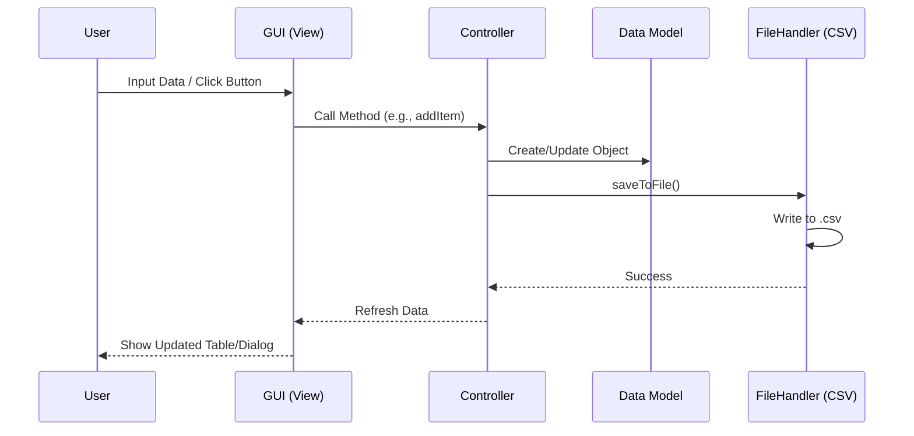

# Feature Branch: CRUD Implementation

Branch `feature-crud` ini fokus pada implementasi operasi **CRUD (Create, Read, Update, Delete)** untuk manajemen barang (Items) dan peminjaman (Loans) di aplikasi SIMORG.

## 📋 Fitur Utama di Branch Ini

### 1. Item Management (Inventaris)

Implementasi lengkap CRUD untuk data barang:

- **Create**: Menambah barang baru dengan validasi input.
  - _Class_: `ItemController.addItem()`
  - _Data_: Disimpan ke ID unik (format `ITM...`).
- **Read**: Menampilkan daftar barang di tabel (`JTable`).
  - _Fitur_: Searching (by keyword) & Sorting (by name, quantity, category).
- **Update**: Mengedit informasi barang yang sudah ada.
  - _Class_: `ItemController.updateItem()`
  - _Auto-save_: Perubahan langsung tersimpan ke file CSV.
- **Delete**: Menghapus data barang dari sistem.
  - _Confirmation_: Dialog konfirmasi sebelum hapus.

### 2. Loan Management (Peminjaman)

Sistem pencatatan peminjaman barang dengan status tracking:

- **Borrow (Create)**: Mencatat peminjaman baru.
  - _Validasi_: Cek stok barang tersedia sebelum dipinjam.
  - _Status Awal_: `DIPINJAM`.
- **Return (Update)**: Mengubah status menjadi `DIKEMBALIKAN`.
  - _Logic_: Stok barang otomatis bertambah kembali.
- **History (Read)**: Melihat riwayat peminjaman (Aktif/Selesai).
- **Delete**: Menghapus record peminjaman (Hanya admin/clean up).

---

## 🛠️ Implementasi Teknis

### Architecture Pattern

Menggunakan **MVC (Model-View-Controller)** yang dimodifikasi untuk aplikasi Desktop Swing.

| Komponen        | Deskripsi                       | Class Utama                                       |
| --------------- | ------------------------------- | ------------------------------------------------- |
| **Model**       | Representasi data objek         | `Item`, `Loan`                                    |
| **View**        | Tampilan GUI (Swing)            | `ItemListPanel`, `ItemFormPanel`, `LoanListPanel` |
| **Controller**  | Logika bisnis & manipulasi data | `ItemController`, `LoanController`                |
| **Data Access** | Baca/Tulis file CSV             | `FileHandler` (via `model` package)               |

### Key Classes

#### `ItemController.java`

Pusat logika untuk manipulasi data barang.

- Menggunakan `ArrayList<Item>` sebagai in-memory cache.
- `Stream API` digunakan untuk filter (search) dan mapping data.
- `Comparator` digunakan untuk fitur sorting dinamis.

#### `IdGenerator.java`

Generator ID unik thread-safe.

- Format Item: `ITM` + Timestamp (ms) + Counter
- Format Loan: `LN` + Timestamp (ms) + Counter
- Mencegah duplikasi ID saat pembuatan data cepat.

---

## 💾 Data Persistence

Data disimpan secara permanen menggunakan format CSV di folder `data/`:

- `items.csv`: Database barang.
- `loans.csv`: Database transaksi peminjaman.

Setiap operasi CRUD (Add/Edit/Delete) akan memicu `saveToFile()` untuk menjamin data tidak hilang.

---

## 🔄 System Flow

Berikut adalah alur data (flow) bagaimana aplikasi bekerja menangani permintaan user.

### 1. General Data Flow (MVC Interaction)

Bagaimana komponen saling berinteraksi saat user melakukan aksi.



### 2. Add Item Flow

Alur detail saat user menambahkan barang baru.

```mermaid
flowchart TD
    Start([User Inputs Data]) --> Validate{Valid Input?}
    Validate -- No --> ShowError[Show Error Message]
    ShowError --> Start
    Validate -- Yes --> GenID[Generate Unique ID (ITM...)]
    GenID --> CreateObj[Create Item Object]
    CreateObj --> AddList[Add to Memory List]
    AddList --> SaveFile[Save to items.csv]
    SaveFile --> UpdateUI[Update Table View]
    UpdateUI --> End([Finish])
```

### 3. Loan Item Flow (Peminjaman)

Alur peminjaman barang dengan pengecekan stok.

```mermaid
flowchart TD
    Request([User Requests Loan]) --> CheckStock{Stock Available?}
    CheckStock -- No --> ErrorStock[Show 'Out of Stock']
    CheckStock -- Yes --> InputData[Input Borrower Data]
    InputData --> GenLoanID[Generate Loan ID (LN...)]
    GenLoanID --> ReduceStock[Decrease Item Quantity]
    ReduceStock --> CreateLoan[Create Loan Record]
    CreateLoan --> SaveAll[Save loans.csv & items.csv]
    SaveAll --> End([Loan Active])
```

---

## ✅ Status Implementasi

- [x] **Item CRUD** (Add, Edit, Delete, View)
- [x] **Search & Filter** Barang
- [x] **Sorting** Barang
- [x] **Loan CRUD** (Borrow, Return, View)
- [x] **CSV Integration**
- [x] **UI Validation**

---

> **Note:** Gunakan branch ini untuk testing dan validasi semua fitur manipulasi data sebelum merge ke main branch.
