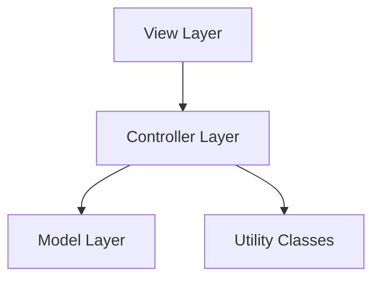

# CRUD Implementation - SIMORG

Dokumentasi implementasi CRUD operations untuk aplikasi inventory management SIMORG.

## Arsitektur



---

## Struktur File

### Model Layer

#### Item.java

**Path**: `src/main/java/com/simorg/model/Item.java`

- Fields: `id`, `name`, `category`, `quantity`, `condition`, `location`, `dateAdded`, `description`
- Constructor, getters, setters
- Method `toCSVString()` dan `fromCSVString()` untuk file handling

---

### Utility Layer

#### IdGenerator.java

**Path**: `src/main/java/com/simorg/util/IdGenerator.java`

- Method `generateItemId()` - format: `ITMyyyyMMddHHmmssSSS`

---

### Controller Layer

#### ItemController.java

**Path**: `src/main/java/com/simorg/controller/ItemController.java`

- Field: `ArrayList<Item> items`
- Methods:
  - `addItem(Item)` - tambah item baru
  - `updateItem(String id, Item)` - update item berdasarkan ID
  - `deleteItem(String id)` - hapus item
  - `getItemById(String id)` - cari item berdasarkan ID
  - `getAllItems()` - ambil semua item
  - `searchItems(String keyword)` - cari berdasarkan nama/kategori
  - `sortItems(String field, boolean ascending)` - sorting
  - `getTotalQuantity()` - total quantity semua item

---

### View Integration

| File                  | Perubahan                                               |
| --------------------- | ------------------------------------------------------- |
| `ItemFormPanel.java`  | Controller integration, save/update/clear functionality |
| `ItemListPanel.java`  | Search, sort, refresh, edit, delete, detail             |
| `DashboardPanel.java` | Dynamic statistics, navigation buttons                  |
| `ReportPanel.java`    | Dynamic stats, category summary                         |
| `MainFrame.java`      | Controller initialization, panel callbacks              |

---

## Cara Menjalankan

```bash
mvn compile exec:java
```

---

## Manual Testing

1. **Test Create Item**

   - Buka menu "Tambah Barang"
   - Isi form dengan data valid
   - Klik "Simpan"
   - Buka "Data Inventaris" → item baru tampil di tabel

2. **Test Read/List Items**

   - Buka "Data Inventaris"
   - Test search field dengan keyword
   - Test sorting dropdown

3. **Test Update Item**

   - Pilih item di tabel → Klik "Edit"
   - Ubah data lalu simpan
   - Verifikasi perubahan di tabel

4. **Test Delete Item**

   - Pilih item di tabel → Klik "Hapus"
   - Konfirmasi dialog
   - Verifikasi item hilang dari tabel

5. **Test Dashboard**
   - Buka Dashboard
   - Verifikasi statistik menampilkan data real
