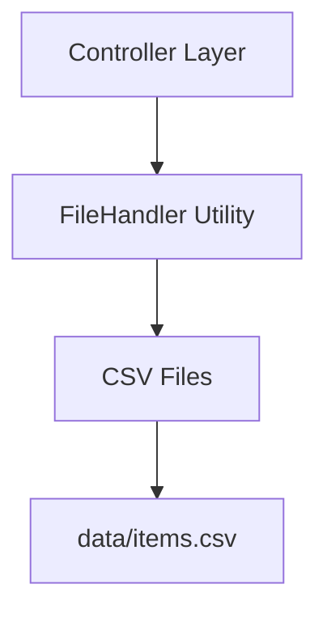

# File Handling Implementation - SIMORG

Dokumentasi implementasi persistensi data menggunakan file CSV untuk SIMORG.

## Arsitektur



---

## Struktur File

### FileHandler.java

**Path**: `src/main/java/com/simorg/util/FileHandler.java`

Utility class untuk operasi baca/tulis file CSV.

**Methods:**
| Method | Deskripsi |
|--------|-----------|
| `loadItems()` | Baca items dari CSV |
| `saveItems(List<Item>)` | Tulis items ke CSV |
| `ensureDataDirectory()` | Buat folder data jika belum ada |

**Constants:**

- `DATA_DIR` = "data"
- `ITEMS_FILE` = "data/items.csv"

---

## Controller Integration

### ItemController

- `loadFromFile()` - Load items dari CSV ke memory
- `saveToFile()` - Simpan items dari memory ke CSV
- Auto-save dipanggil setelah: `addItem()`, `updateItem()`, `deleteItem()`

---

## MainFrame Integration

Pada startup, MainFrame memanggil:

1. `itemController.loadFromFile()` - Load data items

---

## Format CSV

### items.csv

```csv
id,name,category,quantity,condition,location,dateAdded,description
ITM...,Laptop Dell,Elektronik,5,Baik,Ruang IT,2024-12-01,Laptop kerja
```

---

## Error Handling

| Kondisi                | Perilaku                          |
| ---------------------- | --------------------------------- |
| File tidak ditemukan   | Return empty list (aplikasi baru) |
| Parse error pada baris | Skip baris, log warning           |
| Folder data tidak ada  | Buat otomatis saat save           |

---

## Cara Menjalankan

```bash
mvn compile exec:java
```

Data akan tersimpan di folder `data/` setelah operasi CRUD.
